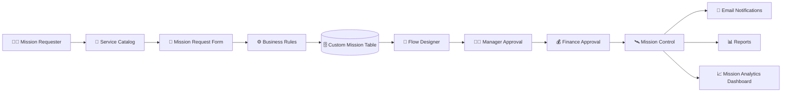

<div align="center">


# 🚀 Intergalactic Space Travel Request (ISTR)

### 🌌 Enterprise Workflow Automation Platform built using ServiceNow

<p align="center">


</p>

<p align="center">


</p>

---

### 🌍 A centralized ServiceNow application that automates the complete lifecycle of intergalactic mission requests through intelligent workflows, enterprise security, dashboards, reports, and real-time approvals.

<br>

<p align="center">

<a href="https://mdadilshariff.github.io/ISTR-MISSION-REQUEST-SYSTEM/">

</a>

<a href="(https://www.youtube.com/watch?v=ND5_3TZqlyU)">

</a>

<a href="docs/ISTR_Final_Project_Report.pdf">

</a>

</p>

</div>

---

# 🌠 Why ISTR?

> Traditional mission request systems depend on emails, spreadsheets, and manual approvals, leading to delays, poor visibility, and inconsistent tracking.

**ISTR transforms this process into a centralized, secure, and fully automated ServiceNow application featuring:**

- 🚀 Digital Mission Requests
- 🔄 Automated Multi-Level Approval Workflow
- 🔐 Role-Based Access Control (ACLs)
- 📧 Smart Email Notifications
- 📊 Live Dashboards
- 📈 Reports & Analytics
- ⚡ Enterprise Workflow Automation

---
<div align="center">

# 🌌 About The Project


</div>

Traditional mission request systems rely heavily on manual paperwork, email communication, and disconnected approval processes. These challenges often lead to delayed approvals, poor visibility, inconsistent record management, and inefficient collaboration across departments.

**Intergalactic Space Travel Request (ISTR)** is a modern **ServiceNow Scoped Application** developed to eliminate these challenges by providing a centralized platform for submitting, approving, tracking, and analyzing intergalactic mission requests.

The application leverages **ServiceNow App Engine Studio** to automate the complete mission lifecycle—from request submission through multi-level approvals, notifications, reporting, and dashboards—while maintaining enterprise-grade security using Role-Based Access Control (RBAC).

---

## ✨ Core Highlights

<table>
<tr>

<td align="center" width="25%">

### 🚀

### Mission Requests

Submit and manage space mission requests through an intuitive Service Catalog interface.

</td>

<td align="center" width="25%">

### 🔄

### Workflow Automation

Multi-level approval process powered by Flow Designer.

</td>

<td align="center" width="25%">

### 🔐

### Enterprise Security

ACLs, Users, Groups and Roles ensure secure access.

</td>

<td align="center" width="25%">

### 📊

### Analytics

Real-time dashboards and reports for complete mission visibility.

</td>

</tr>
</table>

---

# 🎯 Objectives

<table>

<tr>
<td>✅</td>
<td>Automate mission request submission</td>
</tr>

<tr>
<td>✅</td>
<td>Reduce manual paperwork</td>
</tr>

<tr>
<td>✅</td>
<td>Improve approval efficiency</td>
</tr>

<tr>
<td>✅</td>
<td>Provide centralized mission tracking</td>
</tr>

<tr>
<td>✅</td>
<td>Strengthen enterprise security</td>
</tr>

<tr>
<td>✅</td>
<td>Generate reports and dashboards</td>
</tr>

<tr>
<td>✅</td>
<td>Enhance transparency across departments</td>
</tr>

<tr>
<td>✅</td>
<td>Improve overall operational efficiency</td>
</tr>

</table>

---

# 💡 Why ISTR?

<table>

<tr>

<th>Traditional Process</th>

<th>ISTR Solution</th>

</tr>

<tr>

<td>Manual paperwork</td>

<td>Digital Service Catalog</td>

</tr>

<tr>

<td>Email approvals</td>

<td>Automated Flow Designer workflow</td>

</tr>

<tr>

<td>No tracking</td>

<td>Real-time status updates</td>

</tr>

<tr>

<td>Scattered records</td>

<td>Centralized custom table</td>

</tr>

<tr>

<td>No reporting</td>

<td>Interactive dashboards & reports</td>

</tr>

<tr>

<td>Security issues</td>

<td>Role-Based ACLs</td>

</tr>

</table>

---

# 🛰️ Key Functionalities

| Module | Description |
|----------|-------------|
| 🚀 Mission Request | Submit new mission requests |
| 📋 Record Management | Manage mission information |
| 🔄 Approval Workflow | Manager → Finance → Mission Control |
| ⚙️ Business Rules | Backend automation |
| 💻 Client Scripts | Client-side validation |
| 🎨 UI Policies | Dynamic field behavior |
| 📧 Notifications | Automated emails |
| 📊 Dashboard | Mission analytics |
| 📈 Reports | Operational insights |
| 🔐 ACL Security | Secure role-based access |

---
# 🏗️ System Architecture

The **Intergalactic Space Travel Request (ISTR)** application is built entirely on the **ServiceNow App Engine Platform**, utilizing native platform capabilities to deliver a secure, scalable, and enterprise-grade workflow automation solution.



---

# ⚙️ Application Workflow

<div align="center">

| Stage | Description |
|:------:|-------------|
| 📝 **Draft** | User fills the mission request form through the Service Catalog. |
| 🚀 **Submitted** | Request is stored in the custom mission table. |
| 👨‍💼 **Manager Review** | Manager verifies mission feasibility and approves or rejects the request. |
| 💰 **Finance Approval** | Budget allocation and financial approval are processed. |
| 🛰️ **Mission Control** | Final operational approval before mission scheduling. |
| 📧 **Notification** | Automated emails are sent at every important state transition. |
| 📊 **Analytics** | Reports and dashboards are updated automatically. |

</div>

---

# 🏛️ Application Components

<table>

<tr>
<th width="30%">Component</th>
<th>Description</th>
</tr>

<tr>
<td>🛒 Service Catalog</td>
<td>Provides a guided interface for submitting new mission requests.</td>
</tr>

<tr>
<td>🗄️ Custom Table</td>
<td>Stores mission details, approvals, status, and operational information.</td>
</tr>

<tr>
<td>⚙️ Business Rules</td>
<td>Automates backend logic including state updates and approval handling.</td>
</tr>

<tr>
<td>💻 Client Scripts</td>
<td>Performs client-side validation before form submission.</td>
</tr>

<tr>
<td>🎨 UI Policies</td>
<td>Dynamically controls field visibility and mandatory conditions.</td>
</tr>

<tr>
<td>🔄 Flow Designer</td>
<td>Automates the complete multi-level approval workflow.</td>
</tr>

<tr>
<td>🔐 ACL Security</td>
<td>Restricts CRUD operations based on assigned roles.</td>
</tr>

<tr>
<td>📧 Notifications</td>
<td>Sends automated emails for submissions, approvals, and state changes.</td>
</tr>

<tr>
<td>📊 Reports</td>
<td>Provides operational and analytical reporting.</td>
</tr>

<tr>
<td>📈 Dashboard</td>
<td>Displays real-time mission KPIs and workflow metrics.</td>
</tr>

</table>

---

# 📊 Technology Stack

<div align="center">

| Layer | Technology |
|:------|:-----------|
| 🌐 Platform | ServiceNow App Engine Studio |
| 🖥️ Frontend | Service Portal · Service Catalog |
| 🔄 Workflow | Flow Designer |
| ⚙️ Backend | Business Rules |
| 💻 Client Logic | Client Scripts |
| 🎨 Dynamic Forms | UI Policies |
| 🗄️ Database | Custom Scoped Table *(extends Task)* |
| 🔐 Security | ACLs · Users · Roles · Groups |
| 📧 Notifications | ServiceNow Email Engine |
| 📈 Reporting | ServiceNow Reports |
| 📊 Dashboard | Performance Analytics |

</div>

---

# 📦 Project Metrics

<div align="center">

| 📈 Metric | Count |
|:---------|------:|
| Functional Modules | **10** |
| Custom Tables | **1** |
| Flow Designer Workflows | **2** |
| Business Rules | **2** |
| Client Scripts | **1** |
| UI Policies | **1** |
| ACL Rules | **10** |
| Roles | **5** |
| Groups | **5** |
| Email Notifications | **4** |
| Reports | **4** |
| Dashboard Widgets | **6** |
| User Stories | **12** |
| Story Points | **34** |
| Test Cases Executed | **15+** |

</div>

---
# 📂 Repository Structure

```text
ISTR/
│
├── 📁 docs/
│   ├── Final Project Report
│   ├── Functional & Performance Testing
│   ├── User Acceptance Testing (UAT)
│   ├── Solution Architecture
│   ├── Customer Journey Map
│   ├── Problem–Solution Fit
│   ├── Technology Stack
│   └── Project Planning Documents
│
├── 📁 update-set/
│   └── ISTR Scoped Application.xml
│
├── 📁 images/
│   └── Banner & Assets
│
├── 📄 README.md
├── 📄 LICENSE
└── 📄 .gitignore
```

---

# 📚 Documentation

The project documentation covers the complete software development lifecycle.

| 📄 Document | Description |
|-------------|-------------|
| 🧠 Brainstorming | Initial ideation and project planning |
| 🎯 Customer Problem Statement | Customer pain points and proposed solution |
| 🗺 Customer Journey Map | User journey from request creation to mission completion |
| 💡 Problem–Solution Fit | Validation of the proposed solution |
| 🏗 Solution Architecture | System architecture and workflow |
| 📋 Technology Stack | Platform and implementation details |
| 📈 Project Planning | Agile planning, user stories and sprint breakdown |
| 🧪 Functional & Performance Testing | Functional validation and performance testing |
| ✅ User Acceptance Testing | End-user testing and verification |
| 📖 Final Project Report | Consolidated project documentation |

---

# 🔒 Security Implementation

The application follows enterprise security best practices using native ServiceNow capabilities.

| Security Feature | Implementation |
|------------------|----------------|
| 🔐 Authentication | ServiceNow User Authentication |
| 👥 Authorization | Users, Groups & Roles |
| 🛡 Access Control | 10 ACL Rules |
| 📝 Data Validation | Client Scripts & Business Rules |
| 📂 Record Security | Role-Based CRUD Permissions |
| 📧 Audit & Notifications | Email Notifications & Activity Logs |

---

# 🧪 Testing Summary

| Testing Type | Status |
|--------------|:------:|
| Functional Testing | ✅ Passed |
| Workflow Testing | ✅ Passed |
| Business Rule Validation | ✅ Passed |
| Client Script Validation | ✅ Passed |
| UI Policy Validation | ✅ Passed |
| ACL Security Testing | ✅ Passed |
| Email Notification Testing | ✅ Passed |
| Report Validation | ✅ Passed |
| Dashboard Verification | ✅ Passed |
| User Acceptance Testing | ✅ Passed |

---

# 🚀 Future Roadmap

- [x] Service Catalog Integration
- [x] Multi-Level Approval Workflow
- [x] Business Rules
- [x] Client Scripts
- [x] UI Policies
- [x] ACL Security
- [x] Email Notifications
- [x] Reports
- [x] Mission Analytics Dashboard
- [ ] AI-powered Mission Risk Prediction
- [ ] Predictive Approval Timelines
- [ ] Native Mobile Application
- [ ] External Space Agency Integration
- [ ] AI Chatbot Assistant
- [ ] Live Mission Tracking

---

# 🎥 Demonstration

The complete project walkthrough demonstrates:

- 🚀 Mission Request Submission
- 🔄 Flow Designer Approval Workflow
- 👨‍💼 Manager Approval
- 💰 Finance Approval
- 🛰 Mission Control Approval
- 🔐 ACL Security
- 📧 Email Notifications
- 📊 Mission Analytics Dashboard
- 📈 Reports & Analytics

> 📺 **YouTube Demonstration:**  
> `(https://www.youtube.com/watch?v=ND5_3TZqlyU)`

---

# 📦 Deployment

Since ISTR is a **ServiceNow Scoped Application**, it is deployed using native ServiceNow deployment mechanisms.

Supported deployment methods include:

- Scoped Application Export (.xml)
- Update Set (.xml)
- Application Repository
- ServiceNow App Engine Studio

---

# 🤝 Acknowledgements

Special thanks to:

- ServiceNow App Engine Platform
- ServiceNow Flow Designer
- Performance Analytics
- ServiceNow Developer Program
- KKR & KSR Institute of Technology & Sciences

---

# 👨‍💻 Developer

<div align="center">

## **MD. ADIL SHARIFF**

**B.Tech — Computer Science Engineering (Artificial Intelligence & Machine Learning)**

### ServiceNow Developer • AI Enthusiast • Full Stack Developer 

<p>

<a href="https://github.com/mdadilshariff">

</a>

<a href="www.linkedin.com/in/adil-shariff-mohammed">

</a>

<a href="mailto:adilshariff2006@gmail.com">

</a>

</p>

</div>

---

<div align="center">

# ⭐ Thank You for Visiting!

If you found this project interesting or useful, please consider giving the repository a **⭐ Star**.

### 🚀 *Built with ServiceNow App Engine Studio*


</div>
